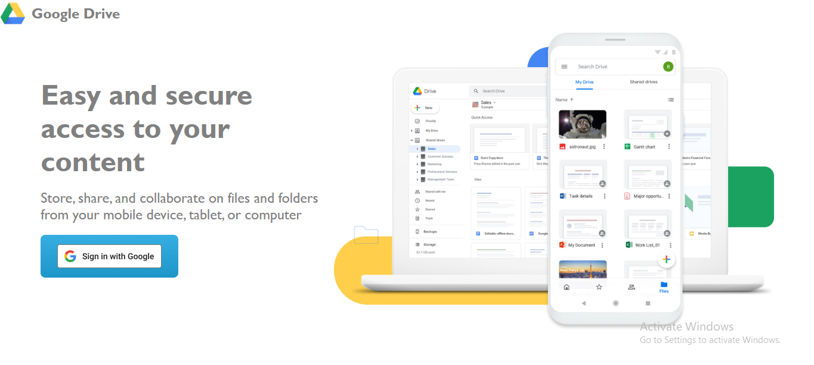
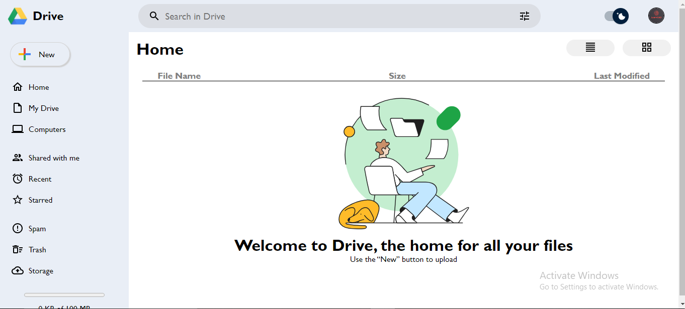
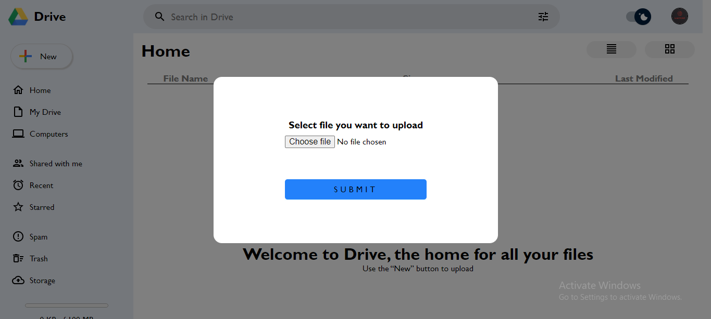

# Google Drive Clone Project

This is a Google Drive clone project built using React.js. The project uses Firebase for data storage and authentication, including Google login.

## Features

- User authentication using Google Sign-In
- File upload and storage using Firebase Storage
- Display and manage files

## Technologies Used

- React.js
- Firebase (Authentication, Firestore, Storage)
- Material-UI for icons and components
- CSS Modules for styling

## UI

